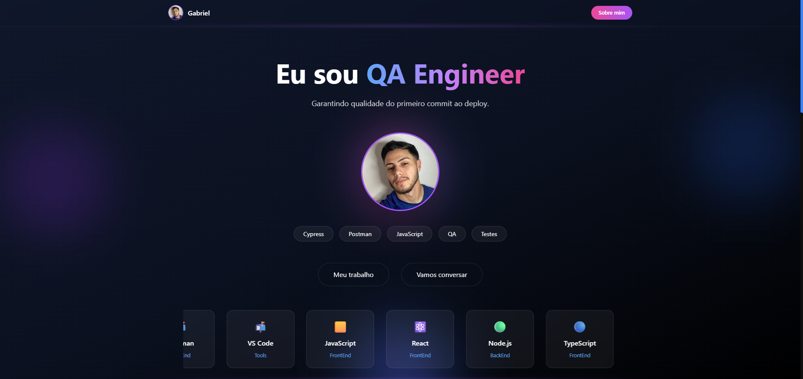

# 🚀 Portfolio – Lucas Gabriel

Portfólio moderno desenvolvido com React, Vite e TailwindCSS, com foco em performance, animações suaves e identidade visual moderna.

## 👨‍💻 Sobre

Sou QA Engineer com foco em automação de testes, qualidade de software e boas práticas de desenvolvimento.

Este portfólio foi criado para apresentar meus projetos, tecnologias e experiência de forma interativa e visualmente impactante.

---

## 🛠️ Tecnologias Utilizadas

- React
- Vite
- TailwindCSS
- JavaScript
- Framer Motion
- Lucide Icons

---

## ✨ Funcionalidades

- 🎨 UI moderna com gradientes
- 🔥 Mouse Glow interativo acompanhando o cursor
- 🎬 Animações de entrada ao scroll
- 📦 Cards de projetos com hover animado
- 🔗 Links diretos para GitHub
- 📧 Contato via mailto
- 📱 Layout responsivo

---

## 📂 Estrutura do Projeto

```bash
src/
 ├── components/
 │    ├── About.jsx
 │    ├── Contact.jsx
 │    ├── Hero.jsx
 │    ├── MouseGlow.jsx
 │    ├── Navbar.jsx
 │    ├── Projects.jsx
 │    ├── Reveal.jsx
 │    └── TechCarousel.jsx
 │
 ├── data/
 │    ├── projects.js
 │    └── techs.js
 │
 ├── App.jsx
 ├── index.css
 └── main.jsx
```

---

## 📸 Preview

```bash



```

---

## ⚙️ Como rodar o projeto

```bash
# Clonar o repositório
git clone https://github.com/seuusuario/portfolio

# Entrar na pasta
cd portfolio

# Instalar dependências
npm install

# Rodar em ambiente de desenvolvimento
npm run dev
```

---

## 📌 Melhorias Futuras

- [ ] Adicionar formulário de contato funcional
- [ ] Implementar dark/light toggle
- [ ] Melhorar animações do Hero
- [ ] Adicionar modo multi-idioma

---

## 📬 Contato

- 📧 Email: lucasgamendes@gmail.com
- 💼 LinkedIn: https://www.linkedin.com/in/lucas-gabriel2002
- 🐙 GitHub: https://github.com/Lucas1802

---

Desenvolvido com 💙 por **Lucas Gabriel**
